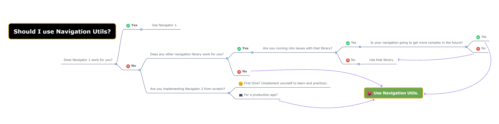
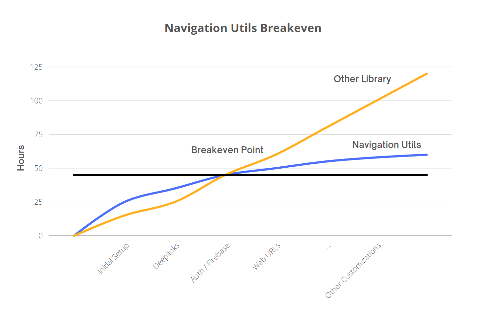

# Navigation Utils
[](https://pub.dev/packages/navigation_utils) [](https://github.com/rayliverified/NavigationUtils) [](https://github.com/rayliverified/NavigationUtils/issues) [](https://github.com/rayliverified/NavigationUtils) [](https://github.com/rayliverified/NavigationUtils) [](https://opensource.org/licenses/0BSD)


> ### The missing navigation library for Navigator 2. 

NavigationUtils simplifies the process of integrating Flutter's Navigator 2 into your applications. 

### Features

- Reimplements the Navigator 1 API in Navigator 2, including `push()`, `pop()`, `pushAndReplace()` and more.
- Full control over the navigation back stack through `set()`.
- Named route support with `pushNamed()`, `setNamed()`.
- Path-based routing support.
- Convenient functions for setting the URL and query parameters.

### Should I use Navigation Utils?

You should use NavigationUtils if the existing Navigation Libraries aren't working for you and you need full control.

- ❌ DON'T USE NavigationUtils if an existing navigation library works for you (GoRouter, RouteMaster, etc).
- ✅ USE NavigationUtils if you're thinking about implementing Navigator 2 directly or writing your own Navigation library.

Here's a helpful diagram for deciding whether NavigationUtils is the right fit for a project.



NavigationUtils does NOT add complexity. Instead, it embraces the intricacies of Navigator 2, providing a nuanced, comprehensive approach to implementing navigation.

A few compelling arguments for using Navigation Utils: 

- You're learning how to use Flutter's Navigator 2, not a third party library. The time you invest won't be wasted.
- You can implement complex navigation schemas without wrestling with the library.
- You can design navigation that seamlessly aligns with your app and architecture, rather than allowing navigation to dictate architectural choices.

As you incorporate more advanced navigation features, like deeplinks, authentication, and URLs, you'll likely encounter growing challenges and limitations that can drive up costs. There comes a point when direct, hands-on experience with Navigator 2 becomes crucial.

<p align="center">

</p>

If navigation hurdles have become a constant in your development process, it's time to bite the bullet and master Navigator 2. The learning curve is steep, but the alternative is a seemingly endless cycle of issues, roadblocks, and limitations.

## Quickstart

### Initial App Routing Configuration

```dart
MaterialApp.router(
      title: 'Navigation Utils Demo',
      routerDelegate: NavigationManager.instance.routerDelegate,
      routeInformationParser: NavigationManager.instance.routeInformationParser,
    );
```

**Tip:** Navigator 2 utilizes `MaterialApp.router` and requires a `RouterDelegate` and `RouteInformationParser`. These components replace the `routes` and `onGenerateRoute` builders of Navigator 1.

The NavigationManager acts as a global singleton, serving as a dependency injector while holding references to the `RouterDelegate` and `RouteInformationParser`. See the customization section for more information on how to use your own dependency injection and custom navigation lifecycle management.

### Initialize NavigationManager

```dart
void main() {
  NavigationManager.init(
      mainRouterDelegate: DefaultRouterDelegate(navigationDataRoutes: routes),
      routeInformationParser: DefaultRouteInformationParser());
  runApp(const MyApp());
}

```

**Tip:** `DefaultRouterDelegate` and `DefaultRouteInformationParser` are convenience classes provided by this library to help you get up and running quickly. For more information on migrating an existing delegate or using a custom implementation, see the customization section.

### Define Routes

```dart
List<NavigationData> routes = [
  NavigationData(
      url: '/',
      builder: (context, routeData, globalData) =>
          const MyHomePage()),
  NavigationData(
      label: ProjectsPage.name,
      url: '/projects',
      builder: (context, routeData, globalData) =>
          const ProjectsPage()),
];

```

**Note:** Each route requires a URL because `NavigationData` maps a URL to a specific page. The NavigationData model holds routing information that Flutter's navigator needs. For more insights on passing query parameters and using page constructors, see customization sections below.

`NavigationData` contains an optional `label` property to support named routing like in Navigator 1. Navigator 2 does not supported named routing out of the box so named routing is reimplemented. Here, `ProjectsPage.name` is a static constant defined in the ProjectPage widget.

```dart
class ProjectsPage extends StatefulWidget {
  static const String name = 'projects';
  
  @override
  _ProjectsPageState createState() => _ProjectsPageState();
}
```

## Navigation

The NavigationData class in the NavigationUtils library is used to encapsulate all the necessary data for defining a route in your application. It provides an easy way to define and manage your routes.

```dart
NavigationData(
  label: ProjectPage.name,
  url: '/project',
  builder: (context, routeData, globalData) =>
      const ProjectPage(),
),
```

- `label`: An optional `String` for named navigation.
- `url`: A `String` that represents the URL for the route. This is used to match the incoming route. It must start with a '/'. 
- `builder`: A `NavigationPageFactory` object. It is a function that returns a `Page` widget. This builder is used to construct the page when the route is navigated to.
- `pageType`: An optional `PageType` enum that can be used to further customize the type of the page. The PageType can be `material`, `cupertino`, or `transparent`.
- `fullScreenDialog`: An optional `bool` that indicates whether the route is a full-screen modal dialog.
- `barrierColor`: An optional `Color` that specifies the color of the barrier that will appear behind the dialog. This is used only if `fullScreenDialog` is `true`.
- `metadata`: A `Map<String, dynamic>` that can hold any additional data you want to associate with the route.

### Usage

NavigationUtils supports path, name, and Route object-based routing. You can directly access these navigation functions through `NavigationManager.instance`.

### Path

Path-based routing can be considered "absolute" routing as each URL path is unique. The path is also the URL shown in the address bar on Web.

```dart
NavigationManager.instance.routerDelegate.push('/projects');
```

### Named

Navigator 1's named route navigation. The name of the route is often defined in the respective page or component and used as a reference for navigation.

```dart
NavigationManager.instance.routerDelegate.push(ProjectsPage.name);
```

### Route Object

Navigation can also use the raw Route object. Here, a DefaultRoute object is created with the specified path, which is then passed to the navigation. This method is primarily used internally and for supporting partial migrations to this library.

```dart
NavigationManager.instance.routerDelegate.pushRoute(DefaultRoute(path: '/projects'));
```

## Routing Parameters

Navigator 2 does not support query parameters, path parameters, route guards, or non-serializable objects out of the box. The default `PageRoute` class only supports URLs and arguments.

Please read and understand the following information as it is crucial to understanding how Navigator 2 works.

**Important:**

- **Arguments are NOT query parameters or related to URL routing in any way. Arguments are an internal parameter used to pass data between pages from the Legacy Navigator 1 implementation.**
- **Navigator 2 uses the full URL string as a unique page identifier. By default it does not do any path processing or conform to expected URL routing logic or behavior. `/home` and `/home/` are treated as two distinct pages.**

Navigator 2's default URL handling behavior is very limited and wrong by default for web. NavigationUtils adds support for URL routing parameters by extending `PageRoute` with a `DefaultRoute` and building an abstraction layer called `NavigationData` on top.

### Query Parameters

Access query parameters via `routeData.queryParameters` in `NavigationData`. Query parameters are stored in a `Map<String, String>` where the key is the query parameter name and the value is the query parameter value.

#### Example

```dart
// Route Definition
NavigationData(
  label: ProjectPage.name,
  url: '/project',
  builder: (context, routeData, globalData) => ProjectPage(
    id: int.tryParse(routeData.queryParameters['id'] ?? ''),
  ),
)
    
// Route Navigation
NavigationManager.instance.push(ProjectPage.name);
NavigationManager.instance.push(ProjectPage.name, queryParameters: {'id': '320'});
NavigationManager.instance.push('/project');
NavigationManager.instance.push('/project', queryParameters: {'id': '320'});
```

`ProjectPage` is mapped to the URL (`'/project'`). An `id` query parameter is used to pass the ID of the project. 

**Note:** All URL parameters are passed as Strings. This is because URLs are not "typed" and Strings by default.

- Extract `ints` and `doubles` with `int.tryParse` and `double.tryParse`.
- Extract `bools` with `routeData.queryParameters[variable] == 'true'` where the value passed in the URL is a `true` or `false` String.

#### Implementation Details

Navigator 2 does not support query parameters "out of the box" as the Navigator 2 API does not have a `query parameter` field. By default, Navigator 2 treats query parameters as part of the URL string and different query parameters as unique pages.

For example, all of the below home `/` URLs are treated as different pages by Navigator 2:

```
/
/?tab=community_page
/?tab=community_page&post=80
/?tab=message_page
/?referrer=google_ads
```

This is a problem because all of the URLs should point to the same page and query parameters should be passed to that page. To support query parameters properly, this library strips query parameters from URLs, stores them, and then rebundles them during the route construction process.

Internally, this library extracts the query parameters (`tab` ) and stores it in the constructed `DefaultRoute` object, passing only the root `/` URL to the underlying Navigator 2 API.

Multiple `NavigationData` instances can be defined with different query parameters to handle various scenarios or variations of the same page, all pointing to the same destination.

### Path Parameters

Path parameters are used to capture dynamic parts of a URL's path. They are denoted by a colon (`:`) followed by a parameter name in the URL pattern. The corresponding values for each path parameter are extracted from the actual URL when a match is found.

Access path parameters via `routeData.pathParameters` in `NavigationData`. Path parameters are stored in a `Map<String, String>` where the key is the path parameter name and the value is the path parameter value.

#### Example

```dart
// Route definition
NavigationData(
  label: ProjectPage.name,
  url: '/project/:projectId',
  builder: (context, routeData, globalData) => ProjectPage(
      id: int.tryParse(routeData.pathParameters['projectId'] ?? ''),
    );
  },
)
    
// Route navigation
NavigationManager.instance.push(ProjectPage.name);
NavigationManager.instance.push(ProjectPage.name, pathParameters: {'projectId': 320});
NavigationManager.instance.push('/project/320');
# Invalid: NavigationManager.instance.push('/project'); /project and /project/320 are different URLs.
```

In the example above, the `ProjectPage` is associated with the URL pattern `'/project/:projectId'`. The value of `projectId` is extracted from the actual URL. These parameters are then used to construct the `ProjectPage` with the corresponding values.

Multiple `NavigationData` instances can be defined with different URL patterns and path parameters to handle various routes and dynamic parts of the URL path.

**Note:** Ensure that the URL patterns in the `NavigationData` instances match the actual URLs accurately to enable correct parameter extraction.

- `/project` and `/project/:projectId` are different URLs. To support both, define a `NavigationData(url: '/project')` and `NavigationData(url: '/project/:projectId')`.
- A trailing slash such as `/project/` does not pass a null ID to `/project/:projectId`. Instead, `/project/` is equivalent to `/project`.

## Deeplinks

A special feature of NavigationUtils is it supports *deeplinks as data* and defining them all *in a single list*. This is done by creating a list of `DeeplinkDestination` instances. 

```dart
List<DeeplinkDestination> deeplinkDestinations = [
  DeeplinkDestination(
    deeplinkUrl: '/deeplink/login',
    destinationLabel: LoginPage.name),
  DeeplinkDestination(
    deeplinkUrl: '/deeplink/signup',
    destinationLabel: SignUpPage.name),
```

Each `DeeplinkDestination` represents a unique deeplink within your application and includes properties such as `deeplinkUrl`, `destinationLabel`, and `destinationUrl` to define the behavior of the deeplink.

This approach offers several advantages:

- **Centralization**: By defining all deeplinks in one place, it becomes easier to manage and update them. You can quickly find, add, remove, or modify deeplinks as your application evolves.
- **Consistency**: Having a single list ensures that every deeplink is defined in a consistent way, making your codebase more maintainable.
- **Flexibility**: Since deeplinks are defined as data, you can dynamically generate, modify, or filter them based on your application's needs.

### Custom Deeplinks Behavior

```dart
DeeplinkDestination(
  deeplinkUrl: '/deeplink/login',
  destinationLabel: LoginPage.name,
  destinationUrl: '/login',
  backstack: [InitializationPage.name, StartPage.name],
  backstackRoutes: [InitializationRoute(), StartRoute()],
  excludeDeeplinkNavigationPages: [ForgotPassword.name],
  shouldNavigateDeeplinkFunction: () {
    if (AuthService.instance.isAuthenticated) return false;
    return true;
  },
  mapArgumentsFunction: (pathParameters, queryParameters) {
    // Remap or process path and query parameters.
    String referrerId = queryParameters['referrer'] ?? '';
    InstallReferrer.instance.setReferrerId(referrerId);

    return {'id': pathParameters['userId'] ?? ''};
  },   
  authenticationRequired: false,
)
```

- `deeplinkUrl`: A required property representing the deep link URL.
- `destinationLabel`: The named route destination of the deep link.
- `destinationUrl`: The URL route of the destination.
- `backstack` and `backstackRoutes`: Specify the route backstack to which the user should return when navigating away from the deep link. Only one of these can be set.
- `excludeDeeplinkNavigationPages`: A list of pages that should be excluded from deep link navigation.
- `shouldNavigateDeeplinkFunction`: A function that determines whether the deep link should be navigated.
- `mapPathParameterFunction`, `mapQueryParameterFunction`, `mapArgumentsFunction`, `mapGlobalDataFunction`: Optional functions that map path parameters, query parameters, arguments, and global data, respectively.
- `authenticationRequired`: A boolean indicating whether authentication is required to navigate the deeplink.

By providing these parameters, NavigationUtils gives you the flexibility to customize deeplink behavior to suit your application's specific needs. Contributors are welcome to open an issue and PR to add additional functionality that might be missing.

### Deeplinks Usage

NavigationUtils includes a convenience function called `NavigationUtils.openDeeplinkDestination` to process URIs and map them to deeplinks. Here is a sample implementation:

```dart
class DefaultRouteParser {
  static bool openDeeplink(Uri? uri) {
    return NavigationUtils.openDeeplinkDestination(
      deeplinkDestinations: deeplinkDestinations,
      routerDelegate: NavigationManager.instance.routerDelegate,
      uri: uri,
      authenticated: AuthService.instance.isAuthenticated,
      currentRoute:
          NavigationManager.instance.routerDelegate.currentConfiguration,
      excludeDeeplinkNavigationPages: doNotNavigateDeeplinkPages,
    );
  }
}
```

- `uri`: The `Uri` object representing the deeplink that you want to open.

- `deeplinkDestinations`: The list of `DeeplinkDestination` instances that define the deeplinks within your application.

- `routerDelegate`: The `BaseRouterDelegate` instance that handles the actual navigation within your application.

- `deeplinkDestination`: An optional `DeeplinkDestination` instance that you want to open. If not provided, the method will try to find the matching destination in the `deeplinkDestinations` list using the `uri`.

- `authenticated`: A boolean value that indicates whether the user is authenticated. This is used when the `DeeplinkDestination` requires authentication. Defaults to `true`.

- `currentRoute`: An optional `DefaultRoute` instance that represents the current route of the application. This is used for checking if the current page is in the `excludeDeeplinkNavigationPages` list.

- `excludeDeeplinkNavigationPages`: A list of strings that represent the labels or paths of the routes that should be excluded from deeplink navigation. If the current route's label or path is in this list, the method will not perform the navigation.

This method tries to find the matching `DeeplinkDestination` for the given `uri` and performs various checks before navigating to the destination. These checks include checking whether the user is authenticated (if required), whether the current route is in the excluded list, and whether a custom navigation function allows the navigation. After these checks, the method navigates to the destination and processes any path parameters, query parameters, arguments, and global data as defined by the `DeeplinkDestination`. Finally, the method updates the route stack using the `routerDelegate` and applies the changes. The method returns `true` if the navigation was successful, and `false` otherwise.

## Route Guards

#### Authentication

NavigationUtils supports the common "Authenticated" route guard through the `authenticationRequired` boolean. 

1. Annotate each `DeeplinkDestination` with `authenticationRequired`.
2. Pass the authentication state from your Authentication Service to `NavigationUtils.openDeeplinkDestination(authenticated: AuthService.instance.isAuthenticated)`.

#### Do Not Navigate Pages

When the user is on certain pages, such as the onboarding page, you may often want to disable deeplinks. NavigationUtils supports this behavior with `excludeDeeplinkNavigationPages`. 

1. Define the list of pages to exclude in `excludeDeeplinkNavigationPages`. This list accepts named routes and path routes.
2. Pass the current page to `currentRoute` like `currentRoute: NavigationManager.instance.routerDelegate.currentConfiguration`.

#### Custom Route Guards

Setup Custom Route Guards by tagging `NavigationData` routes with custom `metadata`.

First, add custom tags to `NavigationData(label: PremiumMemberPage.name, url: '/premium_page', metadata: {kUserStatus: PREMIUM})`. Here, the `PremiumPage` is tagged with `kUserStatus` and requires a `PREMIUM` status to navigate.

```dart
if (NavigationManager.instance.routerDelegate
    .currentConfiguration?.metadata?['kUserStatus'] == PREMIUM) {
  DefaultRouteParser.openDeeplink(uri);
}
```

#### Async Route Guards

NavigationUtils supports route guards through the `shouldNavigateDeeplinkFunction` property of the `DeeplinkDestination` class. This function is called before navigating to the deeplink destination and can be used to prevent navigation based on certain conditions. For example, you can check if a user is authenticated before allowing navigation to a protected route.

### Async Navigation

NavigationUtils supports asynchronous navigation, allowing you to perform asynchronous tasks such as data fetching or authentication checks before navigating to a deeplink destination. This is facilitated by the fact that the `shouldNavigateDeeplinkFunction` can be an asynchronous function, meaning it can return a `Future<bool>` instead of a simple `bool`. This lets you perform any necessary async operations and delay navigation until those operations complete.