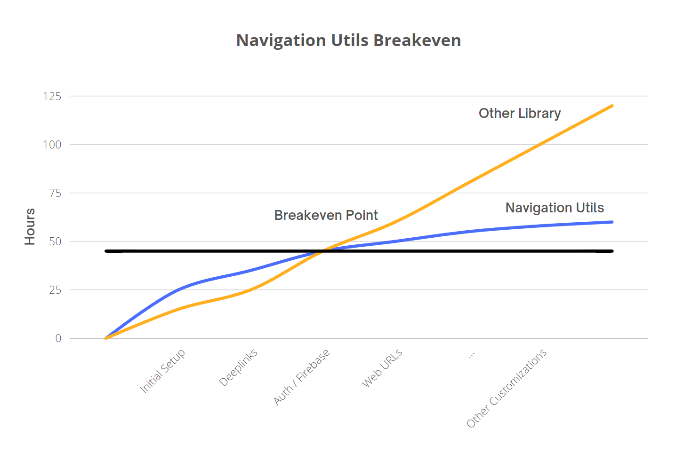

# Navigation Utils
[](https://pub.dev/packages/navigation_utils) [](https://github.com/searchy2/NavigationUtils) [](https://github.com/searchy2/NavigationUtils/issues) [](https://github.com/searchy2/NavigationUtils) [](https://github.com/searchy2/NavigationUtils) [](https://libraries.io/github/searchy2/NavigationUtils) [](https://opensource.org/licenses/0BSD)

> ### The missing navigation library for Navigator 2. 

A collection of convenience methods and wrappers to help implement Flutter's Navigator 2 from the ground up. Use this library to get a head start and save hundreds of hours.

### Features

- Reimplements the Navigator 1 API in Navigator 2 [push(), pop(), etc].
- Absolute control over the navigation back stack [set()].
- Named route support [pushNamed(), setNamed()].
- Support for path based routing.
- Functions for setting the URL and query parameters.

### Should I use Navigation Utils?

Here's a handy diagram to help one decide whether or not to use Navigation Utils.


Navigation Utils is **NOT** more complex than other navigation libraries. However, instead of attempting to abstract away the complexity of Navigator 2, this library exposes the nuance and complexity of implementing navigation.

A few compelling arguments for using Navigation Utils: 

- You're learning how to use Flutter's Navigator 2, not a third party library. The time you invest won't be wasted.
- You'll be able to implement complex navigation without fighting the library.
- Create navigation that conforms to your app and  architecture instead of letting navigation drive architecture decisions.

As you implement more and more navigation features such as deeplinks, authentication, and URLs, you'll run into increasing roadblocks and limitations that increases cost. At a certain point, learning and working directly with Navigator 2 is imperative.

<p align="center">

</p>

If you are running into navigation issues, bite the bullet and learn Navigator 2. There is an initial learning curve but the alternative is to run into countless issues, roadblocks, and limitations.

## Quickstart

### App Routing Setup

```dart
MaterialApp.router(
      title: 'Navigation Utils Demo',
      routerDelegate: NavigationManager.instance.routerDelegate,
      routeInformationParser: NavigationManager.instance.routeInformationParser,
    );
```

**Tip:** Navigator 2 uses `MaterialApp.router` and requires a `RouterDelegate` and `RouteInformationParser` that replaces the `routes` and `onGenerateRoute` builders.

NavigationManager is a global singleton class. Here, it is used as a dependency injection and holds references to the `RouterDelegate` and `RouteInformationParser`. See the customization section for more information on how to use your own dependency injection and custom navigation lifecycle management.

### Initialize NavigationManager

```dart
void main() {
  NavigationManager.init(
      mainRouterDelegate: DefaultRouterDelegate(navigationDataRoutes: routes),
      routeInformationParser: DefaultRouteInformationParser());
  runApp(const MyApp());
}

```

**Tip:** `DefaultRouterDelegate` and `DefaultRouteInformationParser` are convenience classes provided by this library to help you get up and running quickly. For more information on migrating an existing delegate or using a custom implementation, see the customization section.

### Define Routes

```dart
List<NavigationData> routes = [
  NavigationData(
      url: '/',
      builder: (context, routeData, globalData) =>
          const MyHomePage()),
  NavigationData(
      label: ProjectsPage.name,
      url: '/projects',
      builder: (context, routeData, globalData) =>
          const ProjectsPage()),
];

```

**Tip:** URL is required for each route because `NavigationData` maps a URL to a page widget. The `NavigationData` data model / builder bundles routing information together for Flutter's navigation methods to read. For more information on passing query parameters and page constructors, see later sections of the ReadMe.

`NavigationData` contains an optional `label` property to support named routing like in Navigator 1. Navigator 2 does not supported named routing out of the box so named routing is reimplemented. Here, `ProjectsPage.name` is a static constant defined in the ProjectPage widget.

```dart
class ProjectsPage extends StatefulWidget {
  static const String name = 'projects';
  
  @override
  _ProjectsPageState createState() => _ProjectsPageState();
}
```

### Navigation

```dart
// Path
NavigationManager.instance.routerDelegate.push('/projects');

// Name
NavigationManager.instance.routerDelegate.push(ProjectsPage.name);

// Route Object
NavigationManager.instance.routerDelegate.pushRoute(DefaultRoute(path: '/projects'));
```

This library supports path, name, and Route object based routing. Access navigation methods on the Route Delegate directly through the NavigationManager instance.


